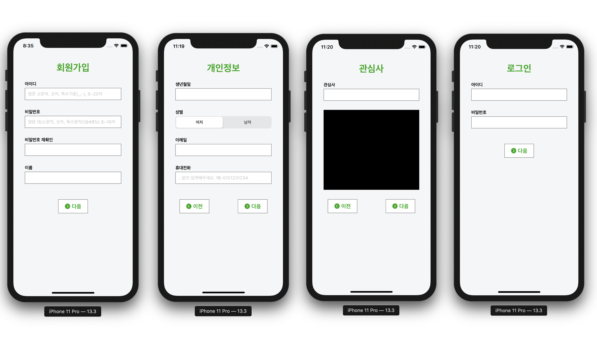
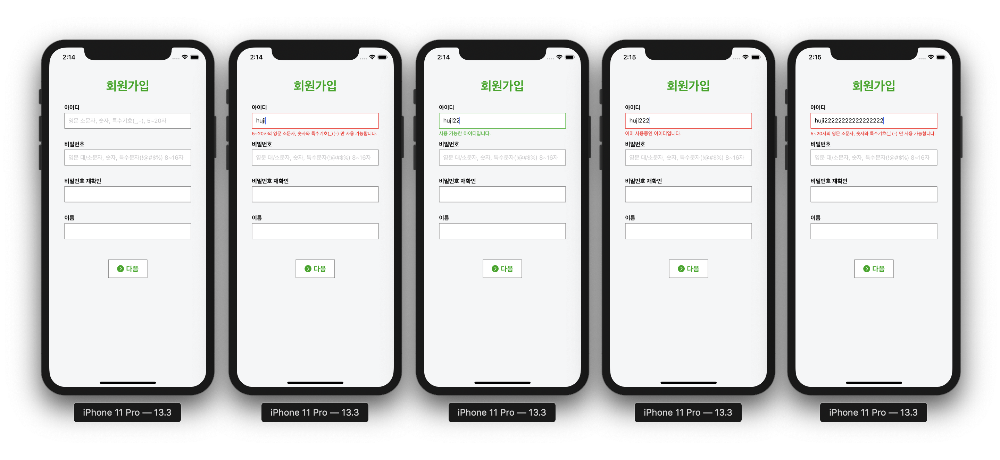

# SignUp iOS

## 단계별 구현 내용

### 사용자 인터페이스 구현

* 텍스트 스타일 클래스 구현
* 스토리보드로 화면 구성

**실행 결과**

### 아이디 유효성 검사

* MVVM을 이용한 뷰 업데이트 방식 구현
* 정규식 검사 결과 또는 중복 검사 결과에 따른 메시지 및 텍스트필드 테두리 색상 업데이트 구현
* 서버에 아이디 중복 검사를 요청하고 그에 따라 뷰 업데이트 구현
* 정규식을 이용해 알파벳 소문자, 숫자, _, - 외의 문자가 존재하는지 검사하며, 검사 결과에 따른 뷰 업데이트 구현

**실행 결과**

